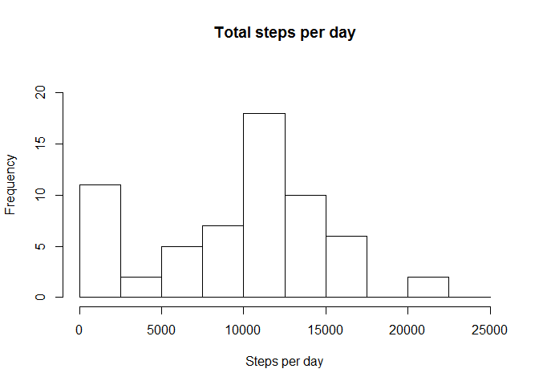
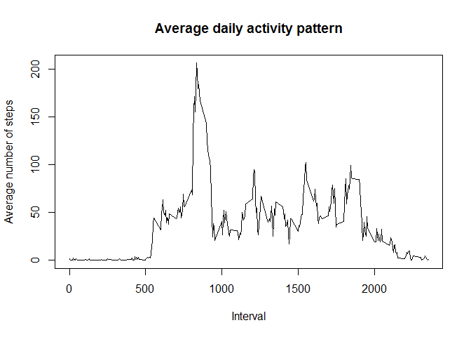
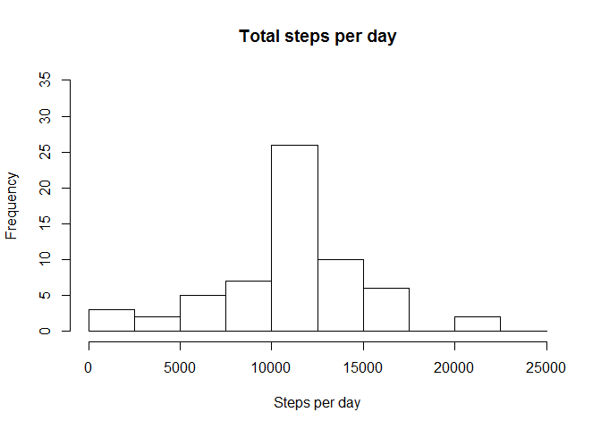
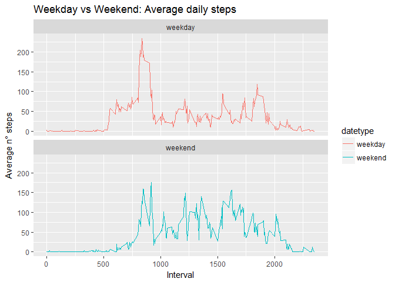

# Reproducible Research: Peer Assessment 1
Domenico Iodice  
02 settembre 2017  


# Course project 1 Reproducible Data

## Loading and preprocessing the data

```r
library(ggplot2)
activity_data<-read.csv("activity.csv")
activity_data$date<-as.POSIXct(activity_data$date, "%Y-%m-%d")
weekday<-weekdays(activity_data$date)
activity_data<-cbind(activity_data,weekday)
```

## What is mean total number of steps taken per day?

```r
tot_steps<-with(activity_data,aggregate(steps,by=list(date),FUN=sum,na.rm = TRUE))
names(tot_steps)<-c("date","steps")
hist(tot_steps$steps,main="Total steps per day",xlab="Steps per day",ylim=c(0,22),
     breaks=seq(0,25000, by=2500))
```

<!-- -->

```r
mean(tot_steps$steps)
```

```
## [1] 9354.23
```

```r
median(tot_steps$steps)
```

```
## [1] 10395
```

## What is the average daily activity pattern?

```r
daily_mean<-aggregate(activity_data$steps,by=list(activity_data$interval),
                                    FUN=mean,na.rm=TRUE)
names(daily_mean)<-c("interval","mean")
plot(daily_mean$interval,daily_mean$mean,type = "l",
     xlab="Interval",ylab="Average number of steps",
     main="Average daily activity pattern")
```

<!-- -->

```r
max_step_interval<-daily_mean[which.max(daily_mean$mean), ]$interval
print(max_step_interval)
```

```
## [1] 835
```
## Imputing missing values

```r
sum(is.na(activity_data$steps))
```

```
## [1] 2304
```

```r
imputed_NA_steps<-daily_mean$mean[match(activity_data$interval,daily_mean$interval)]
activity_NA_data<-transform(activity_data,steps=ifelse(is.na(activity_data$steps),
                                                  yes=imputed_NA_steps,
                                                  no=activity_data$steps))
tot_NA_steps<-aggregate(steps~date,activity_NA_data,sum)
names(tot_NA_steps)<-c("date","daily_steps")
hist(tot_NA_steps$daily_steps, xlab = "Steps per day",ylim = c(0,35),
     main = "Total steps per day",breaks=seq(0,25000,by=2500))
```

<!-- -->

```r
mean(tot_NA_steps$daily_steps)
```

```
## [1] 10766.19
```

```r
median(tot_NA_steps$daily_steps)
```

```
## [1] 10766.19
```

## Are there differences in activity patterns between weekdays and weekends?

```r
activity_data$date<-as.Date(strptime(activity_data$date,format="%Y-%m-%d"))
weekday_or_weekend<-function(x){
                      if(weekdays(x)=="sabato"|weekdays(x)=="domenica") 
                      {y<-"weekend"}
                      else 
                      {y<-"weekday"}
                       y
                                 }
activity_data$datetype<-sapply(activity_data$date,weekday_or_weekend)
activity_data_2<-aggregate(steps~interval+datetype,activity_data,mean,na.rm=TRUE)
plot<-ggplot(activity_data_2,aes(x=interval,y=steps,color=datetype)) +
  geom_line() +
  labs(title = "Weekday vs Weekend: Average daily steps",x="Interval",y ="Average n° steps")+
  facet_wrap(~datetype,ncol=1,nrow=2)
print(plot)
```

<!-- -->
